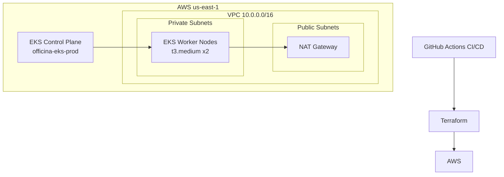

# fiap-tech-challenge-k8s-terraform

## Propósito

Infraestrutura como código (IaC) para provisionar o cluster Kubernetes na AWS usando Terraform. Este repositório cria toda a base de rede e computação necessária para rodar a aplicação de oficina mecânica no Amazon EKS.

**Faz parte do Tech Challenge Fase 3 — FIAP SOAT.**

## Arquitetura



## Tech Stack

- **Terraform** >= 1.3
- **AWS Provider** ~> 5.0
- **Amazon EKS** v1.32
- **Amazon VPC** com subnets públicas e privadas em 2 AZs
- **HPA** (Horizontal Pod Autoscaler) configurado via módulo

## Estrutura do Projeto

```
.
├── main.tf                  ← Módulos principais (VPC, EKS, HPA, RBAC)
├── variables.tf             ← Variáveis de entrada
├── outputs.tf               ← Outputs exportados (vpc_id, cluster_name, etc.)
├── versions.tf              ← Versões dos providers
├── envs/
│   └── prod.tfvars          ← Valores de produção
└── modules/
    ├── vpc/                 ← VPC, subnets, IGW, NAT Gateway, route tables
    ├── eks/                 ← Cluster EKS, node group, IAM (usa LabRole)
    ├── hpa/                 ← HorizontalPodAutoscaler para o app
    └── rbac/                ← ServiceAccount e ClusterRoleBinding
```

## Pré-requisitos

- [Terraform CLI](https://developer.hashicorp.com/terraform/downloads) >= 1.3
- [AWS CLI](https://aws.amazon.com/cli/) configurado com credenciais válidas
- [kubectl](https://kubernetes.io/docs/tasks/tools/) para interagir com o cluster após criação
- Conta AWS com permissões para criar EKS, VPC, EC2 (Node Groups)
- Bucket S3 para armazenar o Terraform state (ex: `fiap-tc-terraform-state`)

> **AWS Academy**: use as credenciais temporárias do painel "AWS Details" > "Show". Elas expiram a cada ~4h.

## Quick Start

### 1. Configurar credenciais AWS

```bash
aws configure set aws_access_key_id     SEU_ACCESS_KEY
aws configure set aws_secret_access_key SEU_SECRET_KEY
aws configure set aws_session_token     SEU_SESSION_TOKEN
aws configure set region                us-east-1
```

### 2. Criar arquivo de variáveis

Crie `envs/prod.tfvars` (não commitar — já está no `.gitignore`):

```hcl
environment        = "prod"
cluster_name       = "oficina-eks-prod"
eks_version        = "1.32"
node_instance_type = "t3.medium"
node_desired_size  = 2
node_min_size      = 2
node_max_size      = 4
newrelic_license_key = "SUA_CHAVE_NEWRELIC"
```

### 3. Inicializar e aplicar

```bash
terraform init \
  -backend-config="bucket=SEU_BUCKET_S3" \
  -backend-config="key=k8s/terraform.tfstate" \
  -backend-config="region=us-east-1"

terraform plan -var-file=envs/prod.tfvars

terraform apply -var-file=envs/prod.tfvars
```

### 4. Configurar kubectl

```bash
aws eks update-kubeconfig --region us-east-1 --name oficina-eks-prod
kubectl get nodes
```

## Outputs

Após o `terraform apply`, os seguintes valores são exportados (usados pelos outros repos):

| Output | Descrição | Usado por |
|--------|-----------|-----------|
| `vpc_id` | ID da VPC criada | db-terraform |
| `private_subnet_ids` | IDs das subnets privadas | db-terraform |
| `public_subnet_ids` | IDs das subnets públicas | — |
| `eks_cluster_name` | Nome do cluster EKS | app (deploy) |
| `eks_cluster_endpoint` | Endpoint da API do cluster | kubectl |

## Deploy CI/CD (GitHub Actions)

O pipeline é acionado automaticamente via `workflow_dispatch` (manual) ou push para `main`.

**Etapas:**
1. `terraform init` — inicializa com backend S3
2. `terraform validate` — valida sintaxe
3. `terraform plan` — gera plano de execução
4. `terraform apply` — aplica na AWS (somente na branch `main`)

**Secrets necessários no repositório:**

| Secret | Descrição |
|--------|-----------|
| `AWS_ACCESS_KEY_ID` | Credencial AWS |
| `AWS_SECRET_ACCESS_KEY` | Credencial AWS |
| `AWS_SESSION_TOKEN` | Token de sessão (AWS Academy) |
| `TF_STATE_BUCKET` | Nome do bucket S3 para o state |
| `AWS_ACCOUNT_ID` | ID da conta AWS |
| `TF_VAR_NEWRELIC_LICENSE_KEY` | Chave do New Relic |

## Custo Estimado (AWS Academy)

| Recurso | Custo |
|---------|-------|
| EKS Control Plane | ~$73/mês ($0.10/h) |
| 2x EC2 t3.medium (nodes) | ~$60/mês |
| NAT Gateway | ~$32/mês |
| **Total estimado** | **~$165/mês** |

> No AWS Academy o custo é coberto pelos créditos do laboratório.

## Limpeza de Recursos

Para destruir toda a infraestrutura ao final:

```bash
terraform destroy -var-file=envs/prod.tfvars
```

## Repositórios Relacionados

| Repo | Descrição |
|------|-----------|
| [fiap-tech-challenge-db-terraform](https://github.com/ThaisAzuos/fiap-tech-challenge-db-terraform) | Banco de dados RDS PostgreSQL — depende dos outputs deste repo |
| [fiap-tech-challenge-lambda-auth](https://github.com/ThaisAzuos/fiap-tech-challenge-lambda-auth) | Autenticação serverless Lambda |
| [fiap-tech-challenge-app](https://github.com/ThaisAzuos/fiap-tech-challenge-app) | Aplicação principal Spring Boot — deploya neste cluster |
